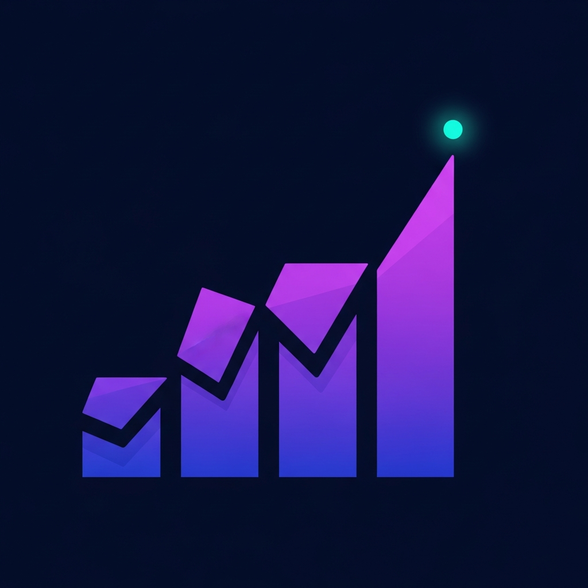

<div align="center">

<br />

<!-- LOGO -->


<h1>Avyron AI</h1>

<p><strong>Autonomous Marketing Intelligence. End-to-End. Zero Guesswork.</strong></p>

<p>
  <a href="https://avyronai.com"><strong>avyronai.com</strong></a> ·
  <a href="#architecture">Architecture</a> ·
  <a href="#how-it-works">How It Works</a> ·
  <a href="#use-cases">Use Cases</a>
</p>

<br />

> **"An AI CMO in a box."**
> Not a prompt tool. Not a skill library. A full end-to-end marketing intelligence pipeline that thinks, strategizes, and executes — so you don't have to.

<br />

</div>

---

## What Is Avyron AI?

Avyron AI is a **single-track autonomous marketing system** that transforms a minimal user input into a complete, strategy-grounded marketing intelligence package.

Where traditional AI tools give you prompts or raw outputs, Avyron runs an orchestrated pipeline of specialized engines — each one validating and building on the last — to deliver outputs at the quality of a senior marketing strategist.

**You provide the context. Avyron handles everything else.**

---

## Core Capabilities

| Capability | Description |
|---|---|
| **Market Intelligence** | Extracts competitor data, messaging patterns, and market positioning from websites and social platforms |
| **Content DNA Extraction** | Identifies tone, structure, style, and the winning content patterns your market already responds to |
| **Problem Analysis** | Detects real customer pain points and demand signals — not assumptions |
| **Audience Definition** | Builds precise, psychographic-rich target audience profiles |
| **Positioning Strategy** | Defines your differentiation angle and market territory |
| **Narrative Strategy** | Produces a structured, story-driven marketing framework (Problem → Cause → Intervention → Result) |
| **Content System** | Generates a full content plan aligned with your strategy and audience |
| **30-Day Calendar** | Delivers a ready-to-execute content schedule, day by day |

---

## Architecture

Avyron AI is built as a **sequential orchestration pipeline** — not a collection of disconnected tools. Each engine receives the validated output of the previous one, ensuring strategic coherence from input to final output.

```
┌─────────────────────────────────────────────────────────────────┐
│                        USER INPUT                               │
│              (product, niche, goals, budget)                    │
└─────────────────────────┬───────────────────────────────────────┘
                          │
                          ▼
┌─────────────────────────────────────────────────────────────────┐
│  ① MARKET INTELLIGENCE ENGINE V3                                │
│  ─────────────────────────────────────────────────────          │
│  • Competitor scraping (web + social)                           │
│  • Gap detection & opportunity mapping                          │
│  • Freshness validation + trust scoring                         │
│  • Output: MI Snapshot (structured, validated)                  │
└─────────────────────────┬───────────────────────────────────────┘
                          │
                          ▼
┌─────────────────────────────────────────────────────────────────┐
│  ② AUDIENCE ENGINE V3                                           │
│  ─────────────────────────────────────────────────────          │
│  • Psychographic profiling from MI Snapshot                     │
│  • Pain point clustering & demand signal analysis               │
│  • Behavioral pattern extraction                                │
│  • Output: Audience Snapshot                                    │
└─────────────────────────┬───────────────────────────────────────┘
                          │
                          ▼
┌─────────────────────────────────────────────────────────────────┐
│  ③ POSITIONING ENGINE V3                                        │
│  ─────────────────────────────────────────────────────          │
│  • Strategic territory definition                               │
│  • Differentiation angle from market gaps                       │
│  • Messaging hierarchy mapping                                  │
│  • Output: Positioning Snapshot                                 │
└─────────────────────────┬───────────────────────────────────────┘
                          │
                          ▼
┌─────────────────────────────────────────────────────────────────┐
│  ④ DIFFERENTIATION ENGINE V3                                    │
│  ─────────────────────────────────────────────────────          │
│  • Unique mechanism identification                              │
│  • Competitive moat construction                                │
│  • Proof architecture                                           │
│  • Output: Differentiation Snapshot                             │
└─────────────────────────┬───────────────────────────────────────┘
                          │
                          ▼
┌─────────────────────────────────────────────────────────────────┐
│  ⑤ OFFER ENGINE V4                                              │
│  ─────────────────────────────────────────────────────          │
│  • Offer structure aligned with audience & positioning          │
│  • Pricing psychology & value ladder mapping                    │
│  • CTA architecture                                             │
│  • Output: Offer Framework                                      │
└─────────────────────────┬───────────────────────────────────────┘
                          │
                          ▼
┌─────────────────────────────────────────────────────────────────┐
│  ⑥ FUNNEL ENGINE V3                                             │
│  ─────────────────────────────────────────────────────          │
│  • Funnel stage mapping (TOFU / MOFU / BOFU)                    │
│  • Conversion touchpoint architecture                           │
│  • Narrative flow per stage                                     │
│  • Output: Funnel Blueprint                                     │
└─────────────────────────┬───────────────────────────────────────┘
                          │
                          ▼
┌─────────────────────────────────────────────────────────────────┐
│  ⑦ CONTENT DNA ENGINE                                           │
│  ─────────────────────────────────────────────────────          │
│  • Tone, voice, and style extraction from winning content       │
│  • Hook pattern identification                                  │
│  • Format templates mapped to platform                          │
│  • Output: Content DNA Profile                                  │
└─────────────────────────┬───────────────────────────────────────┘
                          │
                          ▼
┌─────────────────────────────────────────────────────────────────┐
│  ⑧ NARRATIVE ENGINE                                             │
│  ─────────────────────────────────────────────────────          │
│  • Story-driven marketing framework                             │
│  • Problem → Cause → Intervention → Result structure            │
│  • Messaging pillars per audience segment                       │
│  • Output: Narrative Strategy Document                          │
└─────────────────────────┬───────────────────────────────────────┘
                          │
                          ▼
┌─────────────────────────────────────────────────────────────────┐
│  ⑨ CONTENT SYSTEM + 30-DAY CALENDAR OUTPUT                      │
│  ─────────────────────────────────────────────────────          │
│  • Full content plan (formats, hooks, CTAs)                     │
│  • 30-day execution calendar                                    │
│  • Platform-specific content variations                         │
│  • Output: Ready-to-execute content package                     │
└─────────────────────────────────────────────────────────────────┘
```

---

## Validation Architecture

Avyron AI is designed to **minimize hallucination** through strict data discipline across the pipeline.

```
┌────────────────────────────────────────────────────────┐
│              VALIDATION LAYERS                         │
│                                                        │
│  Layer 1 — Data Grounding                              │
│  ┌────────────────────────────────────────────────┐   │
│  │ All market data is sourced, not assumed.        │   │
│  │ Freshness class + trust score enforced.         │   │
│  └────────────────────────────────────────────────┘   │
│                                                        │
│  Layer 2 — Schema Compatibility Check                  │
│  ┌────────────────────────────────────────────────┐   │
│  │ Each engine snapshot validates against schema  │   │
│  │ before passing output downstream.              │   │
│  └────────────────────────────────────────────────┘   │
│                                                        │
│  Layer 3 — Staleness Coefficient Enforcement           │
│  ┌────────────────────────────────────────────────┐   │
│  │ Stale data is flagged, weighted down, or       │   │
│  │ blocked from influencing strategic outputs.    │   │
│  └────────────────────────────────────────────────┘   │
│                                                        │
│  Layer 4 — Output Separation Gate                      │
│  ┌────────────────────────────────────────────────┐   │
│  │ Strict boundary between analysis engines       │   │
│  │ and generation engines. No cross-contamination │   │
│  │ between data reasoning and content output.     │   │
│  └────────────────────────────────────────────────┘   │
└────────────────────────────────────────────────────────┘
```

---

## How It Works

**Step 1 — You provide minimal context**
- Your product name and description
- Your niche or industry
- Your monthly budget (optional — used to calibrate recommendations)
- Your funnel objective

**Step 2 — Avyron runs the full pipeline**

The system orchestrates all engines automatically. No prompting required. No manual steps. It takes your input and executes the entire pipeline — market research through to content calendar — in a single run.

**Step 3 — You receive a complete intelligence package**

| Output | Description |
|---|---|
| Market Intelligence Report | Competitor analysis, gap map, opportunity matrix |
| Audience Profile | Psychographic snapshot, pain clusters, buying triggers |
| Positioning Document | Your strategic angle, differentiation, messaging hierarchy |
| Narrative Framework | Your brand story structure, messaging pillars |
| Content System | Hooks, formats, CTAs, platform variations |
| 30-Day Calendar | Day-by-day content execution plan |

---

## Example Output Snapshot

```
────────────────────────────────────────────────
AVYRON AI — STRATEGIC INTELLIGENCE REPORT
Campaign: [Product Name] · Run: 2026-04-02
────────────────────────────────────────────────

MARKET INTELLIGENCE
  Competitors analyzed:     4
  Content gaps identified:  11
  Demand signals captured:  23
  Freshness class:          FRESH (< 72h)
  Trust score:              0.91

POSITIONING ANGLE
  Territory:    "The system that replaces strategy guesswork"
  Differentiator: Narrative-led, validation-grounded output
  Unique Mechanism: Sequential intelligence pipeline

NARRATIVE FRAMEWORK
  Problem:       Founders waste months on disconnected marketing
  Cause:         No single system connects research to execution
  Intervention:  Avyron runs one pipeline, end-to-end
  Result:        A complete marketing strategy in one run

30-DAY CONTENT CALENDAR
  Week 1:  Authority content — market education hooks
  Week 2:  Problem-aware content — pain point narratives
  Week 3:  Solution-aware content — mechanism reveals
  Week 4:  Conversion content — proof + CTA sequences

System Readiness:  94% ████████████████████░ 
────────────────────────────────────────────────
```

---

## Use Cases

### For Founders & Solopreneurs
Launch with a full marketing strategy from day one. No agency. No months of research. Avyron gives you the intelligence that used to take a senior CMO to produce.

### For Marketing Agencies
Run Avyron at the start of every client engagement to produce a grounded strategy brief in hours instead of weeks. Use the output to anchor your creative and content teams.

### For Content Creators
Stop posting by instinct. Avyron maps your niche, identifies what's working, and gives you a 30-day content system built around your specific audience and market position.

### For E-Commerce Brands
Understand your competitors, define your positioning, and get a conversion-optimized content strategy — all grounded in real market data, not generic advice.

### For SaaS Companies
Map the competitive landscape, extract what messaging wins, and build a narrative that positions your product as the clear choice for your target segment.

---

## Key Differentiators

| Avyron AI | Traditional AI Tools |
|---|---|
| End-to-end orchestrated pipeline | Disconnected single-task prompts |
| Narrative-driven strategic output | Raw bullet-point data dumps |
| 4-layer validation architecture | No data quality controls |
| Content DNA integration | Generic content templates |
| Single run → complete package | Multiple tools, manual assembly |
| Designed for strategic reliability | Optimized for speed, not quality |

---

## Technical Stack

| Layer | Technology |
|---|---|
| Mobile App | React Native (Expo) |
| Backend API | Node.js + Express + TypeScript |
| AI Engines | OpenAI GPT-4o + Gemini 1.5 Pro |
| Database | PostgreSQL |
| Authentication | JWT |
| Deployment | Avyron Cloud (avyronai.com) |

---

## Plans

| Plan | Price | For |
|---|---|---|
| **Launch** | $80 one-time | Founders validating a new product or niche |
| **Scale** | $250/month | Growing teams running ongoing intelligence |
| **Dominion** | $500/month | Agencies and enterprises running multiple campaigns |

---

## Support

- Email: support@avyronai.com
- Website: [avyronai.com](https://avyronai.com)

---

<div align="center">
<sub>Built for operators who want to move fast without thinking slow.</sub>
</div>
